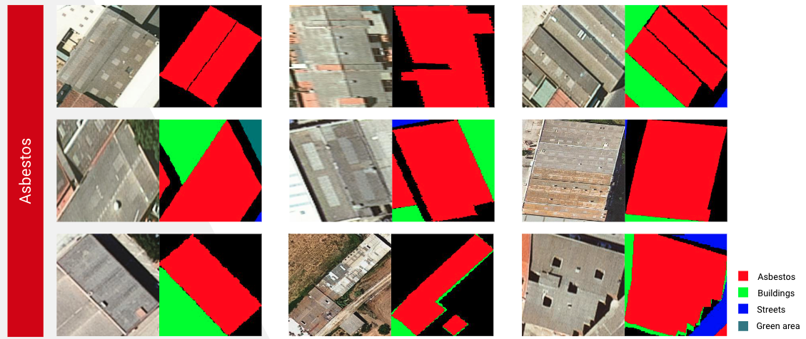
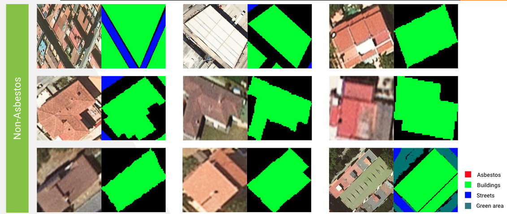

# Automatic detection of fiber-cement roofs in aerial images (Master dissertation)

In this project we can see different methods to resolve a computer vision problem implemented to resolve a Fiber-cement (Asbestos) problem for my own master dissertation in collaboration with Univesidad Oberta de Catalunya (UOC) in the master offered by the universities UAB, UPC, UPF and UOC.

Fiber-cement detection are a important work for the prevention of disease in the society. These kind of materials can be harmful for the health and we keep it in much of our buildings. This project try to help the companies/governments that works in its remove process.

## Dataset example

## Techniques used in this project
For the purpose of this project we implemented the next models and we found the code in this projecte:
- MaskRCNN -> Instances detection/segmentation ([Detectron2](https://github.com/facebookresearch/detectron2))
- FasterCNN -> Instances detection ([Detectron2](https://github.com/facebookresearch/detectron2))
- ResNet18 -> Binary classification ([PyTorch](https://pytorch.org/))
- Triple embedding using ResNet18 -> Embedding Space ([PyTorch](https://pytorch.org/))

## Code

## Results
